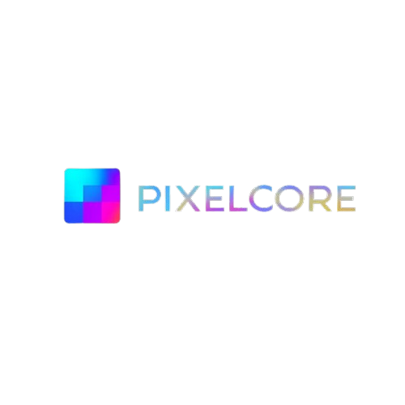

# 🚀 PixelCore – Inovando o Presente. Construindo o Futuro.  

## 🌌 Visão Geral

**PixelCore** é uma empresa tech que transforma ideias em soluções visuais, inteligentes e escaláveis. Este repositório contém o desenvolvimento do site institucional, totalmente responsivo, moderno e adaptado para **modo claro/escuro**, utilizando **Tailwind CSS + Flowbite + FontAwesome** para uma experiência elegante e performática.

> _Tecnologia, automação e criatividade unidas em um só propósito: destacar a sua marca no universo digital._

---

## ✨ Tecnologias Utilizadas

- 🧩 **HTML5 + Tailwind CSS**
- 🌙 **Dark Mode / Light Mode Toggle**
- 🧠 **Flowbite UI Components**
- 🤖 **FontAwesome Icons**
- 🔧 **JavaScript Modular (theme toggle, interações)**

---

## 📁 Estrutura do Projeto
PixelCore/
├── index.html
├── src/
│ ├── img/ # Imagens e logos
│ ├── js/ # Scripts (theme toggle, navegação)
│ └── css/ # Estilos adicionais (se necessário)
└── README.md

## ⚙️ Funcionalidades do Site

- 🎯 **Landing page institucional** com navegação fluida
- 💡 Sessões:
  - Início
  - Sobre nós
  - Serviços oferecidos
  - Equipe
- 🌓 **Modo claro/escuro com persistência**
- 🔗 Navegação responsiva com menu hamburguer
- 📱 Totalmente adaptado para mobile, tablet e desktop

## 🧑‍💻 Time de Desenvolvimento

| Nome         | Função                     | Contato                      |
|--------------|-----------------------------|------------------------------|
| Bruno Sousa  | Frontend Developer / UI Dev | [[@bruno-linkedin](https://www.linkedin.com/in/bruno-sousa-849754261/)]         |
